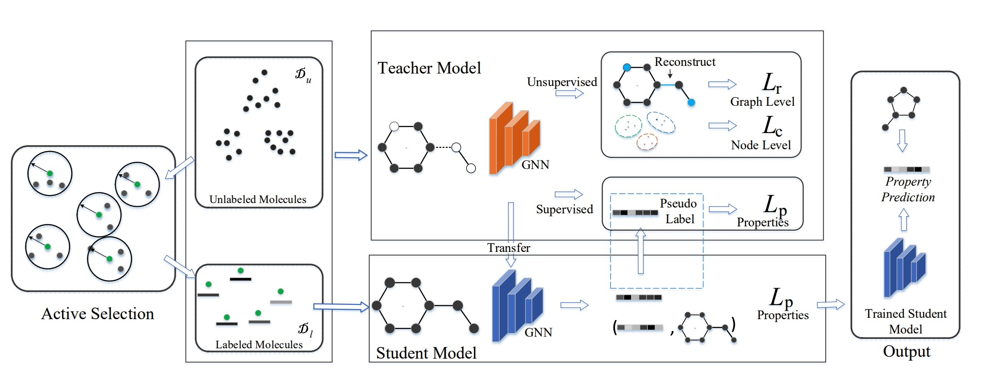

<p align="center">
  
  <br />
  <br />
</p> 

# ASGN

The official implementation of the ASGN model.
Orginal paper: ASGN: An Active Semi-supervised Graph Neural Network for Molecular Property Prediction. KDD'2020 Accepted. 

# Project Structure
+ `base_model`: Containing SchNet and training code for QM9 and OPV datasets. 

+ `rd_learn`: A baseline using random data selection.

+ `geo_learn`: Geometric method of active learning like k_center.

+ `qbc_learn`: Active learning by using query by committee.

+ `utils`: Dataset preparation and utils functions.
+ `baselines`: Active learning baselines from [google's implementation](https://github.com/google/active-learning).

+ `single_model_al`: contains several baseline models and our method ASGN (in file wsl_al.py)

+ `exp`: Experiments loggings.


# Citing ASGN
If you use ASGN in your research, please use the following BibTex.
```
@inproceedings{hao2020asgn,
  title={ASGN: An Active Semi-supervised Graph Neural Network for Molecular Property Prediction},
  author={Hao, Zhongkai and Lu, Chengqiang and Huang, Zhenya and Wang, Hao and Hu, Zheyuan and Liu, Qi and Chen, Enhong and Lee, Cheekong},
  booktitle={Proceedings of the 26th ACM SIGKDD International Conference on Knowledge Discovery \& Data Mining},
  pages={731--752},
  year={2020}
}
```


